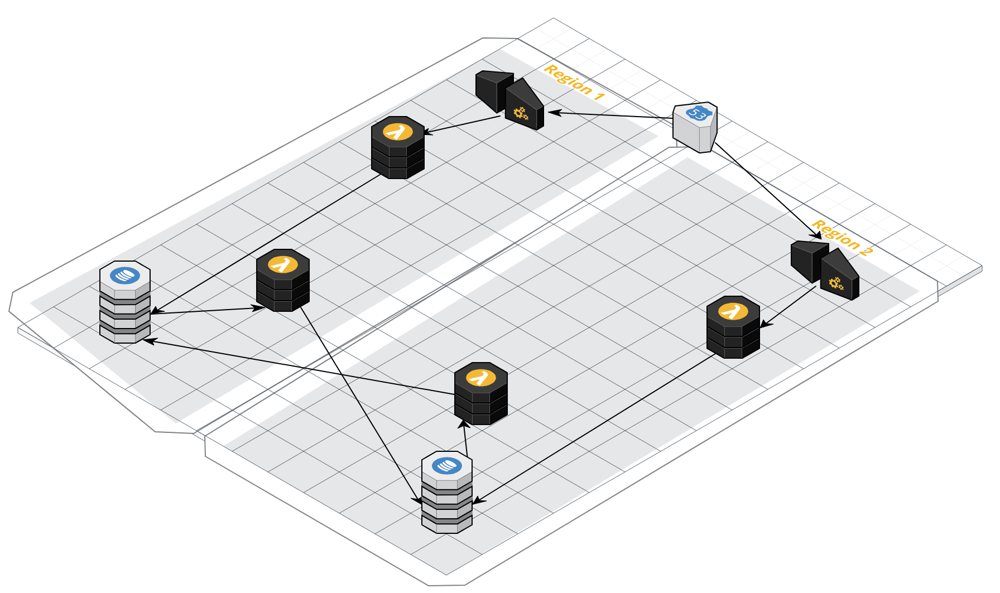

# Richmeister 2

Note: obsoleted by global tables. So no more makin' copies for the Richmeister...

Tastes great like the original Richmeister, but less filling.

Richmeister 2 performs multi-region replication, but makes a different 
tradeoff. The original richmeister traded scalability and throughput for
longer data retention for cases where an application's requirements dictate
the data to be replicated between regions be retained longer that the 
24 hour retention window associated with DynamodDB streams.

This in many cases will not be an appropriate tradeoff, as if a region
is out longer than 24 hours and your users are active in the surviving region, the relevance of the older data has probably diminshed significantly
and will likely be discarded based on the conflict resolution strategy.

Thus, this version will remove the FIFO queue used to retain data to replicate, and will instead replicate changes directly.

This library imposes some requirements on the client:

* When creating or modifying an item in the replicated table, the caller must include three attributes:
    * ts - numeric timestamp, such as milliseconds since the epoch
    * wid - string write id attribute, used to break ties should conflicting writes with
    identical timestamps occur. A random uuid would work well.
    * replicate - a boolean attribute used to indicate if the item should be replicated. This attribute us stripped from the remote write, and we use its absence to eliminate replication cycles without having to traverse regions to use conflict resolution.

This solution consumes events from the DynamodDB table stream, and for the case where
replicate is true, the data is replicated, subject to the conflict resolution criteria.

For conflict resolution, the latest timestamp will be the winner, and if timestamps are identical, the write ids are compared to select the write. 

The components can be installed using the provided cloud formation templates. Refer to the [jupyter](http://jupyter.org/) notebook in the testing directory to see what a multiregion set up looks like, and to view the test cases illustrating how conflict resolution works.

## Current Performance Limitations

Current node implementation should be good for at least 20 TPS steady load - testing at 47TPS revealed that the write of records in the destination region lagged the source region. Note
that batchWriteItem cannot be used as it does not support conditional writes.

Current implementation (Python) falls behind in the replication from us-east-1 to us-west-2 
somewhere between 6.5 and 9.5 write/s on the primary side.
